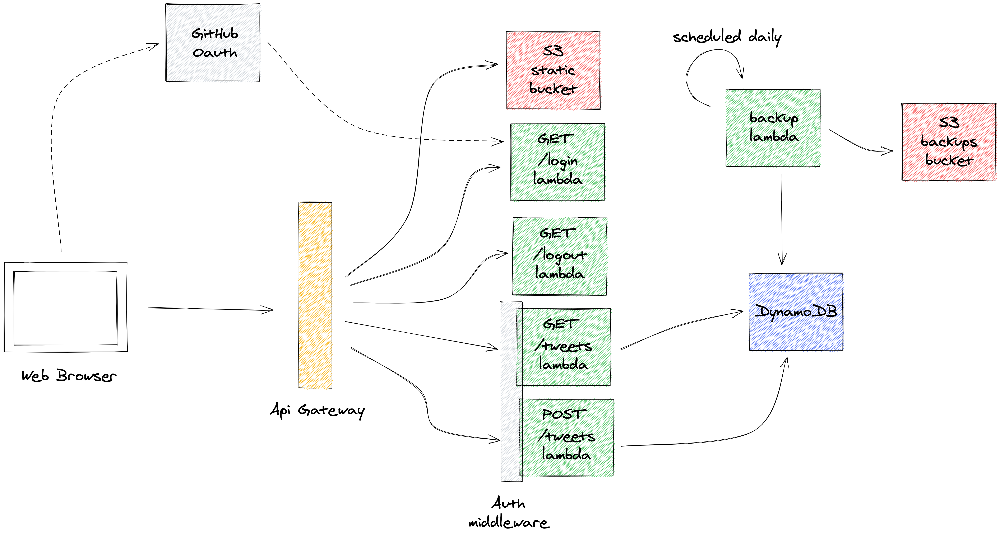

# Twittarc

My solution to the [Social Networking Serverless Kata](https://github.com/petecocoon/Social-Networking-Serverless-Kata).
The application is a TypeScript application built with [Architect](https://arc.codes).
It is my first ever attempt at building a serverless app.

# Setting up development environment

## Prerequisites

- NodeJS >= 12.x;
- A global `Architect` installation: `npm i -g @architect/architect`
- Configured `aws` cli (follow setup instructions [here](https://docs.aws.amazon.com/cli/latest/userguide/install-cliv2.html))

## Setup GitHub OAuth

Follow [the instructions](https://docs.github.com/en/developers/apps/creating-an-oauth-app) to create a GitHub OAuth app.

Once this is done, create a `.env` file in the root directory of the project with the following variables:

```
APP_SECRET=<your_app_secret>
GITHUB_CLIENT_SECRET=<your_client_secret>
GITHUB_CLIENT_ID=<your_client_id>
```

- `APP_SECRET`: an arbitrary string that will be used to sign a JWT, to verify the authentication request really came
  from the app;
- `GITHUB_CLIENT_ID`: the Client ID of your GitHub OAuth app;
- `GITHUB_CLIENT_SECRET`: a Client Secret of your GitHub OAuth app.

# Running the application locally

Running `npm run dev` should compile the application and start the Architect sandbox.
The app should be available at the address printed to stdout.

_N.B:_ scheduled functions are not supported by the local sandbox.

# Running tests

`npm test` will run the available unit tests.

# Deploying to AWS

To deploy to a `staging` environment:

Setup environment variables with `arc env`:

```bash
arc env staging GITHUB_CLIENT_ID <your_client_id>
arc env staging GITHUB_CLIENT_SECRET <your_client_secret>
arc env staging APP_SECRET <your_app_secret>
```

Run `npm run deploy -- staging --dry-run` to generate the CloudFormation template to deploy the app.

Run `npm run deploy -- staging` to generate the CloudFormation template and deploy to AWS.

## Monitoring logs

All functions are configured to send logs to CloudWatch.
`arc logs` will print logs for the whole application. You can also monitor a single function by running `arc logs path/to/function-directory`. For example:

```bash
arc logs src/http/get-tweets
```

# Project structure and relevant files

```
.
├── @types
├── app.arc
├── public
├── src
  ├── http
  ├── macros
  ├── scheduled
  └── shared
```

- `app.arc`: app manifest, used by Architect to provision all app resources;
- `public`: static files, includes the UI;
- `src/http`: includes the implementation of lambda functions;
- `src/macros`: custom macros that modify the CloudFormation template at generation time;
- `scheduled`: scheduled functions, contains the lambda that backups dynamo to S3;
- `shared`: code shared by all functions, includes the authentication middleware.

# Architecture



The app exposes an interface hosted on a dedicated S3 bucket. The UI calls some HTTP APIs backed by AWS functions to retrieve the available tweets and create new ones. If no session is available, a dedicated auth middleware will prevent access to data and the UI will invite the user to login.

Tweets are stored in a DynamoDB table; the table is backed up daily by a dedicated function to an S3 bucket, for analytics purposes.

Architecture diagram exported from CloudFormation:


# About the implementation

Being my first ever AWS app, it took me some time to wrap my head around a lot of new AWS concepts.

Some part of the application could be improved:

- The logic related to GitHub auth could be better encapsulated;
- Logging should be improved;
- I should probably choose a better partition key for the tweets table.
- There are not enough tests: I have to figure out how to forge a session cookie to check for
  authenticated scenarios without requiring GitHub credentials.

# License

See [license file](./LICENSE.md)
